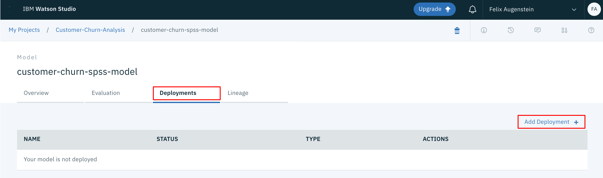

<h1 align="center" style="border-bottom: none;">:bar_chart: IBM Digital Tech Tutorial: Watson Studio Part III</h1>
<h3 align="center">In this hands-on tutorial you will graphically build and evaluate machine learning models by using the SPSS Modeler flow feature in IBM Watson Studio.</h3>

## Prerequisites

1. Sign up for an [IBM Cloud account](https://cloud.ibm.com/registration).
2. Fill in the required information and press the „Create Account“ button.
3. After you submit your registration, you will receive an e-mail from the IBM Cloud team with details about your account. In this e-mail, you will need to click the link provided to confirm your registration.
4. Now you should be able to login to your new IBM Cloud account ;-)

## Digital Tech Tutorial Watson Studio Part I to IV

This tutorial consists of 4 parts, you can start with part I or any other part, however, the necessary environment is set up in part I.<br>
[Part I - data visualization, preparation, and transformation](https://github.com/you-R-I/Workshop_Watson-Studio-ICP4D-Part1)<br>
[Part II - build and evaluate machine learning models by using the AutoAI](https://github.com/you-R-I/Workshop_Watson-Studio-ICP4D-Part2)<br>
[Part III - graphically build and evaluate machine learning models by using the SPSS Modeler flow](https://github.com/you-R-I/Workshop_Watson-Studio-ICP4D-Part3)<br>
[Part IV - set up and run Jupyter Notebooks to develop a machine learning model](https://github.com/you-R-I/Workshop_Watson-Studio-ICP4D-Part4)

The 4 parts of this tutorial are based on the [Learning path: Getting started with Watson Studio](https://developer.ibm.com/series/learning-path-watson-studio/).

## Create model flow

To create an initial machine learning flow:

1. From the Assets page, click Add to project.
2. In the Choose asset type page, select Modeler Flow.


3. On the Modeler page, select the ‘From File’ tab.
4. Download the model flow that is named ‘customer-churn-flow.str’ from this repository.
5. Drag the downloaded modeler flow file to the upload area or browse for it. This also sets the name for the flow.


6. Change the name and provide a description for the machine learning flow (optional).
7. Click Create. This opens the Flow Editor that can be used to create a machine learning flow.

You have now imported an initial flow that we’ll explore in the rest of this tutorial.


Under the Modeling drop-down menu, you can see the various supported modeling techniques. The first one is Auto Classifier, which tries several techniques and then presents the results of the best one.

The main flow itself defines a pipeline consisting of several steps:

- A Data Asset node for importing the data set
- A Type node for defining metadata for the features, including a selection of the target attributes for the classification
- An Auto Data Prep node for preparing the data for modeling
- A Partition node for partitioning the data into a training set and a testing set
- An Auto Classifier node called ‘churn’ for creating and evaluating the model

Additional nodes have been associated with the main pipeline for viewing the input and output. These are:
- A Table output node called ‘Input Table’ for previewing the input data
- A Data Audit node called ’21 fields’ (default name) for auditing the quality of the input data set (min, max, standard, and deviation)
- An Evaluation node for evaluating the generated model
- A Table output node called ‘Result Table’ for previewing the results of the test prediction

Other input and output types can be viewed by selecting the Outputs drop-down menu.

## Assign data asset and run the flow

To run the flow, you must first connect the flow with the appropriate set of test data available in your project.

1. Select the three dots of the Data Asset node to the left of the flow (the input node).
2. Select the Open command from the menu. This shows the attributes of the node in the right part of the page. 


3. Click Change data asset to change the input file. 
4. On the next page, select your .CSV file that contains the customer churn, and click OK. 
5. Select comma(,) as a field delimiter, none as quote character and period (.) as decimal symbol.
6. Click Save.
7. Click Run (the arrow head) in the toolbar to run the flow.


Running the flow creates a number of outputs or results that can be inspected in more detail.


## Understanding the data

Now that you have run the flow, take a closer look at the data.

1. Select the View outputs and versions command from the upper-right portion of the toolbar.
2. Select the Outputs tab.


3. Double-click the output for the “data audit” node named “21 Fields.” Alternatively, select the three dots associated with the output and select Open from the pop-up menu.

This gives you an overview of the data columns, such as the values for their minimum, maximum, mean, and standard deviation, like the one in the following image.


For each feature, the overview shows the distribution in graphical form and whether the feature is categorical or continuous. For numerical features, the computed min, max, mean, standard deviation, and skewness are shown as well. From the column named Valid, you can see that there are 3333 valid values, which means that no values are missing for the listed features and you do not need to bother further with this aspect of preprocessing to filter or transform the columns with lacking values.

## Data preparation

You can change the initial assessment of the features made by the import by using the Type node, which happens to be the next node in the pipeline. To achieve this:

1. Go back to the Flow Editor by selecting ‘customer-churn-flow’ in the toolbar.
2. Select the Type node.
3. Select the Open command from the pop-up menu.

This provides a table that shows the features (such as fields), their kind (for example, continuous or flag), and role, along with others.


The Measure can be changed if needed using this node and it is also possible to specify the role of a feature. In this case, the role of the churn feature (which is a Flag with True and False values) has been changed to Target. The Check column might give you more insight into the values of the field.

Click Cancel to close the property editor for the Type node.

The next node in the pipeline is the Auto Data Prep node. This node automatically transforms the data, such as converting categorical fields into numerical ones. To view its results:

1. Select the Auto Data Prep node in the flow editor.
2. Select Open from the pop-up menu.

This node offers a multitude of settings, for example, for defining the objective of the transformation (optimize for speed or for accuracy).


The previous image shows that the transformation has been configured to exclude fields with too many missing values (threshold is 50) and to exclude fields with too many unique categories. Assume that the latter applies to the phone numbers and don’t worry about them.

The next node in the pipeline is the Partition node, which splits the data set into a training set and a testing set. For the current Partition node, an 80-20 split has been used.


## Training the model

The next node in the SPSS Modeler flow is the Auto Classifier node named “churn.” This node trains the model based on various build options, such as how to rank and discard generated models (using threshold accuracy).


If you Open the node and select the BUILD OPTIONS option from the drop-down menu, you see the property Number of models to use is set to 3, which is the default value. Feel free to change it to a higher number, and then click Save to save the changes.

Remember to rerun the flow if you change any build settings.


## Evaluating the model

To get more details about the generated model:

1. Select the yellow model icon.
2. Select View Model from the drop-down menu.


This overview section gives you a list of classifier models and their accuracy. In this example, the number of models to use is the default value 3.


As you navigate through this overview section, you’ll notice that the number of options and views that are associated with each estimator varies. In some cases, a hyperlink is provided to dig down into more details.

For example, take a look at the poor performing ‘C&RT’ Tree Model by clicking the name in the table.

On the next page, select the Tree Diagram link to the left to get the tree diagram for the estimator.

You can now hover over either one of the nodes or one of the branches in the tree to get more detailed information about a decision made at a given point.


## Saving and deploying the model

After you create, train, and evaluate a model, you can save and deploy it.

To save the SPSS model:

1. Go back to the flow editor for the model flow.
2. Select the Predicted Output node and open its pop-up menu by selecting the 3 dots in the upper-right corner.
3. Select Save branch as model from the pop-up menu.


A new window opens.


4. Type a model name (for example, ‘customer-churn-spss-model’).
5. Click Save.

The model is saved to the current project and should now appear in the Models section of the Assets tab for the project.


To deploy the SPSS model:

1. Click the saved model in the project Models list.
2. Select the Deployments tab.
3. Click Add Deployment to create a new web service deployment named ‘customer-churn-spss-model-web-service.’
4. Set the deployment type to Web Service.
5. Click Save.



6. Wait until the deployment status goes from Initializing to Deploy success.

## Testing the model

Click on the deployment to get more details. If you click the Implementation tab, you will see the scoring endpoint. In the Code Snippets section, you can see examples of how to access the scoring endpoint programmatically.

On the Test tab, we can pass in a scoring payload JSON object to score the model. After supplying the data, press Predict to score the model. Use the following JSON Code:

```
{"input_data":[{"fields": ["state", "account length", "area code", "phone number", "international plan", "voice mail plan", "number vmail messages", "total day minutes", "total day calls", "total day charge", "total eve minutes", "total eve calls", "total eve charge", "total night minutes", "total night calls", "total night charge", "total intl minutes", "total intl calls", "total intl charge", "customer service calls"], "values": [["NY",161,415,"351-7269","no","no",0,332.9,67,56.59,317.8,97,27.01,160.6,128,7.23,5.4,9,1.46,4]]}]}
```


The prediction result is given in terms of the probability that the customer will churn (1/True) or not (0/False). You can try it with other values.

